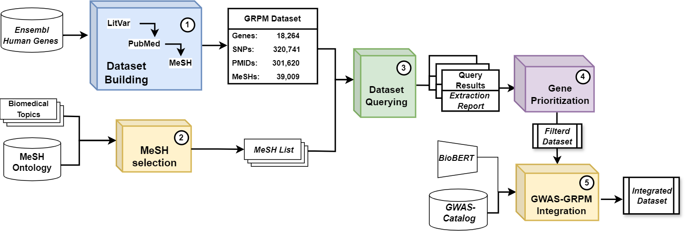

# GRPM System 2.0

The GRPM (Gene-Rsid-Pmid-Mesh) system is an advanced tool designed for the integration and analysis of genetic polymorphism data corresponding to specific biomedical domains. It consists of five modular components that facilitate data retrieval, merging, analysis, and the incorporation of GWAS data.

[](https://www.medrxiv.org/content/10.1101/2023.08.04.23293659v1.full.pdf+html) [](https://doi.org/10.5281/zenodo.8205724)

## Overview

- [Introduction](#introduction)
- [Installation](#installation)
- [Module Description](#modules)
- [Usage](#usage)
- [Updates](#updates)
- [Requirements](#requirements)

## Introduction

The GRPM System is a Python-based framework capable of constructing a comprehensive dataset of human genetic polymorphisms associated with nutrition. By integrating data from multiple sources and utilizing MeSH ontology as an organizational structure, this workflow enables researchers to investigate genetic variants with significant associations to specified biomedical subjects. The primary objective of developing this resource was to support nutritionists in exploring gene-diet interactions and implementing personalized nutrition strategies.


## Installation

You can ***visualize*** and ***query*** the developed datasets by installing our package via:

```
pip install git+https://github.com/johndef64/GRPM_system.git
```

Example queries are available in the `tests` directory. 

Try it in Colab: [](https://colab.research.google.com/github/johndef64/GRPM_system/blob/main/test.ipynb) 


## Module Description

The workflow is composed of five distinct modules, each executing a crucial function to assist in the integration and analysis of genetic polymorphism data associated with nutrition. The modules are outlined below:

To evaluate the our pipeline, execute each module individually by selecting the "Open in Colab" option. Ensure that all necessary dependencies and files are imported. Google Drive synchronization is available.

Each Jupyter notebook includes commands to download and install the necessary dependencies for execution.

| No. | Notebook | Module                                                                                                          | Description                                                                                                            |
| --- | --- |-----------------------------------------------------------------------------------------------------------------|------------------------------------------------------------------------------------------------------------------------|
| 1. | [](https://colab.research.google.com/github/johndef64/GRPM_system/blob/main/GRPM_01_main_dataset_build.ipynb) | [Dataset Builder](https://github.com/johndef64/GRPM_system/blob/main/GRPM_01_main_dataset_build.ipynb)          | Retrieves and integrates data from the LitVar and PubMed databases in a structured format.                             |
| 2. | [](https://colab.research.google.com/github/johndef64/GRPM_system/blob/main/GRPM_02_mesh_selection.ipynb) | [MeSH Term Selection](https://github.com/johndef64/GRPM_system/blob/main/GRPM_02_mesh_selection.ipynb)          | Extracts a coherent MeSH lists to query the GRPM Dataset starting from simple biomedial terms collections (NLP based). |
| 3. | [](https://colab.research.google.com/github/johndef64/GRPM_system/blob/main/GRPM_03_dataset_querying.ipynb) | [Dataset Querying](https://github.com/johndef64/GRPM_system/blob/main/GRPM_03_dataset_querying.ipynb)           | Exexute ***MeSH query*** in the GRPM dataset, extracting a subset of matching entities, and generates a data report.   |
| 4. | [](https://colab.research.google.com/github/johndef64/GRPM_system/blob/main/GRPM_04_data_analysis.ipynb) | [Gene Prioritization](https://github.com/johndef64/GRPM_system/blob/main/GRPM_04_data_analysis.ipynb)  | Analyzes retrieved data and computes ***gene interest index*** to filter significative results.                        |
| 5. | [](https://colab.research.google.com/github/johndef64/GRPM_system/blob/main/GRPM_05_gwas_grpm_integration.ipynb) | [GWAS Data Integration](https://github.com/johndef64/GRPM_system/blob/main/GRPM_05_gwas_grpm_integration.ipynb) | Merges ***GWAS data***, associating phenotypes and potential risk/effect alleles with the GRPM data (BioBERT based).   |



These modules form an exhaustive framework enabling researchers and nutritionists to analyze genetic polymorphism data and derive insights into gene-diet interactions and personalized nutrition interventions.


## Usage

Comprehensive instructions for the usage of each module are found within the respective Jupyter Notebooks provided. Follow the guidelines closely and install the necessary Python packages specified for each module.

## Updates

The GRPM Dataset accessible on Zenodo represents a version of [LitVar1](https://www.ncbi.nlm.nih.gov/CBBresearch/Lu/Demo/LitVar/help.html), which has since been deprecated and replaced by [LitVar2](https://www.ncbi.nlm.nih.gov/research/litvar2/). Module 1 ([Dataset Builder](https://github.com/johndef64/GRPM_system/blob/main/GRPM_01_dataset_builder.ipynb)) has been updated for compatibility with LitVar2. The other modules in the pipeline remain operational using the original GRPM Dataset as available on Zenodo.


## Requirements

All requirements are outlines in  `requirements.txt` and in  `setup.py`
