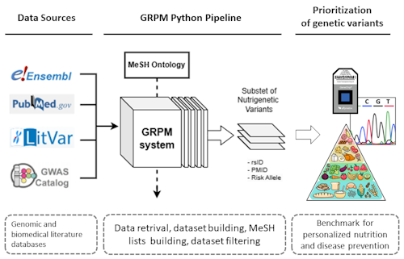
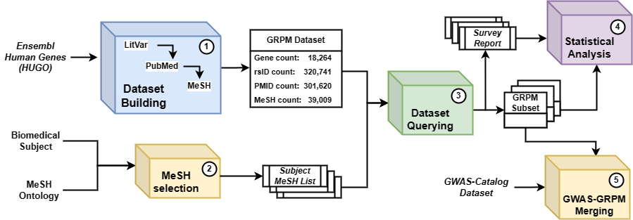

# GRPM System

GRPM (Gene-Rsid-Pmid-Mesh) system is a comprehensive tool designed to integrate and analyze genetic polymorphism data associated with specific biomedical subjects. It comprises five modules that allow data retrieval, merging, analysis, and incorporation of GWAS data.

[](https://www.medrxiv.org/content/10.1101/2023.08.04.23293659v1.full.pdf+html)
[](https://doi.org/10.5281/zenodo.8205724)

## Overview

- [Introduction](#introduction)
- [Modules](#modules)
- [Updates](#updates)
- [Installation](#installation)
- [Usage](#usage)
- [Requirements](#requirements)

## Introduction

GRPM System is a Python framework able to build a comprehensive dataset of human genetic polymorphisms associated with nutrition. By combining data from multiple sources and utilizing MeSH terms as a framework, this workflow enables researchers to explore the vast genetic literature in search of variants significantly associated with a specific biomedical subject.
The main purpose of developing this resource was to assist nutritionists in investigating gene-diet interactions and implementing personalized nutrition interventions.



## Modules

The GRPM System comprises five modules that perform various tasks to facilitate the integration and analysis of genetic polymorphism data associated with nutrition. These modules are as follows:

To try out GRPM System. Run each module separately by clicking the "Open in Colab". Be careful to import all necessary dependencies and files. Google Drive folder synch option available.

Each Jupyter notebook is provided with  the code for downloading and installing the necessary requirements for their execution.

| No. | Notebook | Module                                                                                                            | Description |
| --- | --- |-------------------------------------------------------------------------------------------------------------------|-------------|
| 1. | [](https://colab.research.google.com/github/johndef64/GRPM_system/blob/main/GRPM_01_dataset_builder.ipynb) | [Dataset Builder](https://github.com/johndef64/GRPM_system/blob/main/GRPM_01_dataset_builder.ipynb)               | Retrieves data from LitVar and PubMed databases, merging them into a CSV format.
| 2. | [](https://colab.research.google.com/github/johndef64/GRPM_system/blob/main/GRPM_02_ref-mesh_builder.ipynb) | [MeSH Selection for Retrieval](https://github.com/johndef64/GRPM_system/blob/main/GRPM_02_ref-mesh_builder.ipynb) | Defines a coherent MeSH term list for information retrieval over the whole GRPM Dataset using NLP.
| 3. | [](https://colab.research.google.com/github/johndef64/GRPM_system/blob/main/GRPM_03_dataset_survey.ipynb) | [GRPM Dataset MeSH Query](https://github.com/johndef64/GRPM_system/blob/main/GRPM_03_dataset_survey.ipynb)        | Employs MeSH terms for GRPM dataset retrieval. It extracts a subset of matched entities making a Data Report.
| 4. | [](https://colab.research.google.com/github/johndef64/GRPM_system/blob/main/GRPM_04_grpm-data_analyzer.ipynb) | [GRPM Data Analyzer](https://github.com/johndef64/GRPM_system/blob/main/GRPM_04_grpm-data_analyzer.ipynb)         |Analyzes retrieved data and calculates survgey metrics. Data visualization trough `matplotlib` and `seaborn`. 
| 5. | [](https://colab.research.google.com/github/johndef64/GRPM_system/blob/main/GRPM_05_gwas_grpm_merger.ipynb) | [GRPM-GWAS Data Integration:](https://github.com/johndef64/GRPM_system/blob/main/GRPM_05_gwas_grpm_merger.ipynb)                        | Integrates GWAS data associating GWAS phenotypes and potential risk/effect alleles with the GRPM Dataset. 




These modules provide a comprehensive framework for researchers and nutritionists to explore genetic polymorphism data and gain insights into gene-diet interactions and personalized nutrition interventions.


## Updates

The GRPM Dataset available on Zenodo is a snapshot of [LitVar1](https://www.ncbi.nlm.nih.gov/CBBresearch/Lu/Demo/LitVar/help.html). LitVar1 is now <u>**deprecated**</u> and has been fully replaced by [LitVar2](https://www.ncbi.nlm.nih.gov/research/litvar2/). Module 1 ([Dataset Builder](https://github.com/johndef64/GRPM_system/blob/main/GRPM_01_dataset_builder.ipynb)) has been updated to retrieve data from LitVar2. The subsequent modules in the pipeline remain functional and can be tested using the original version of the GRPM Dataset available on Zenodo.

## Installation

To install GRPM System, clone the repository to your local machine:

```
git clone https://github.com/johndef64/GRPM_system.git
```
Otherwise, run each module separately in Google Colab importing Google Drive to keep-up your progress.


## Usage

Detailed instructions on how to use each module of  GRPM System can be found inside the relative Jupyter Module provided in the repository. Make sure to follow the instructions and install the necessary Python packages specified for each module.


## Requirements

GRPM System has the following requirements:

- `Python 3.9 or above`
- `pandas`
- `requests`
- `biopython`
- `nbib`
- `beautifulsoup`
- `openai`
- `matplotlib`
- `seaborn`
- `nltk`


